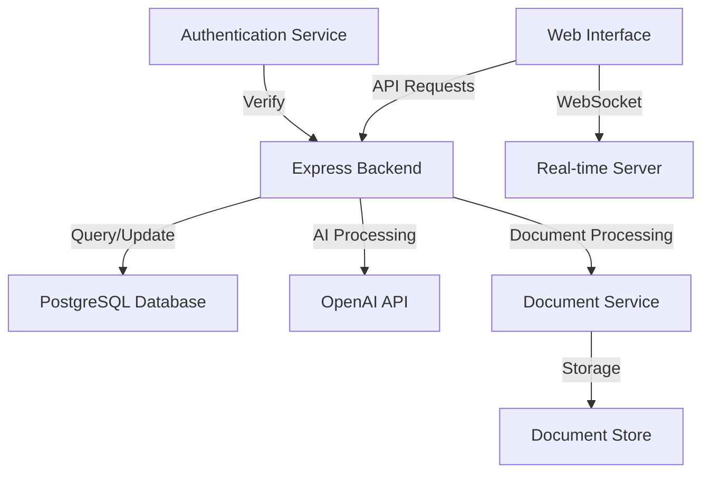

# Transfer Pricing Intelligence Platform


A sophisticated AI-powered platform that revolutionizes transfer pricing compliance and risk management for global finance professionals. This enterprise-grade solution combines advanced analytics, document intelligence, and real-time collaboration to streamline complex transfer pricing workflows.

## 🌟 Key Features

### Document Intelligence
- **Smart Document Upload & Analysis**: AI-powered document processing with automatic language detection and translation
- **Multi-format Document Generation**: Automated generation of compliant transfer pricing documentation
- **Version Control**: Track changes and maintain document history with advanced versioning
- **Entity Management**: Comprehensive entity relationship tracking and documentation

### Risk & Compliance
- **Controversy Management**: 
  - Notice tracking and response management
  - Audit defense documentation
  - Timeline tracking for regulatory deadlines
  - Dispute resolution workflow
- **Compliance Monitoring**:
  - BEPS Action Plans tracking
  - OECD Pillar Two compliance
  - EU ATAD requirements
  - APA management
- **Risk Assessment**: AI-driven risk scoring and analysis

### Analytics & Insights
- **Benchmarking**: Comprehensive comparative analysis tools
- **Market Analysis**: Real-time market data integration
- **AI Insights**: OpenAI-powered analysis and recommendations
- **Custom Analytics**: Tailored reporting and visualization

### Collaboration
- **Real-time Collaboration**: WebSocket-based multi-user editing
- **Team Management**: Role-based access control
- **Workflow Automation**: Customizable approval workflows
- **Communication Tools**: Integrated messaging and notifications

## 🏗 Architecture

### Technical Stack
```
Frontend:
- React with TypeScript
- Shadcn UI Components
- TanStack Query for data fetching
- WebSocket for real-time features
- Wouter for routing

Backend:
- Node.js + Express
- PostgreSQL with Drizzle ORM
- OpenAI API integration
- WebSocket Server

Infrastructure:
- Replit hosting
- PostgreSQL database
- Document storage
```

### System Components


## 📊 Data Models

### Core Entities
```sql
-- Entity Management
Entities {
  id: UUID [pk]
  name: String
  type: Enum [CostPlus, Resale, Distributor, etc.]
  jurisdiction: String
  riskProfile: JSON
  created_at: Timestamp
  updated_at: Timestamp
}

-- Document Management
Documents {
  id: UUID [pk]
  title: String
  content: Text
  metadata: JSON
  version: Integer
  status: Enum [Draft, Review, Final]
  entityId: UUID [ref: > Entities.id]
  created_at: Timestamp
  updated_at: Timestamp
  last_modified_by: UUID [ref: > Users.id]
}

-- Compliance Records
ComplianceRecords {
  id: UUID [pk]
  entityId: UUID [ref: > Entities.id]
  type: Enum [BEPS, PillarTwo, EUATAD]
  status: String
  dueDate: Date
  submissions: JSON
  assessor: UUID [ref: > Users.id]
  created_at: Timestamp
  updated_at: Timestamp
}

-- Controversy Management
Notices {
  id: UUID [pk]
  entityId: UUID [ref: > Entities.id]
  title: String
  content: Text
  noticeType: String
  jurisdiction: String
  receivedDate: Date
  dueDate: Date
  status: String
  priority: String
  assignedTo: UUID [ref: > Users.id]
  created_at: Timestamp
  updated_at: Timestamp
}

-- Benchmarking Data
BenchmarkingData {
  id: UUID [pk]
  entityId: UUID [ref: > Entities.id]
  industryCode: String
  financialMetrics: JSON
  periodStart: Date
  periodEnd: Date
  source: String
  confidence: Float
  created_at: Timestamp
  updated_at: Timestamp
}

-- User Management
Users {
  id: UUID [pk]
  username: String
  email: String
  role: Enum [Admin, Manager, Analyst]
  permissions: JSON
  created_at: Timestamp
  updated_at: Timestamp
}

-- Audit Trail
AuditLogs {
  id: UUID [pk]
  userId: UUID [ref: > Users.id]
  entityId: UUID [ref: > Entities.id]
  action: String
  details: JSON
  timestamp: Timestamp
}
```

## 🚀 Future Development Roadmap

### Phase 1: Enhanced AI Capabilities (Q2 2025)
- [ ] Advanced document summarization using GPT-4
- [ ] Automated risk assessment engine
- [ ] Multi-language support expansion
- [ ] AI-powered compliance recommendations

### Phase 2: Advanced Analytics (Q3 2025)
- [ ] Custom benchmark database integration
- [ ] Advanced visualization tools
- [ ] Predictive analytics for risk management
- [ ] Real-time market data integration

### Phase 3: Collaboration Enhancement (Q4 2025)
- [ ] Advanced workflow automation
- [ ] Document co-editing features
- [ ] Mobile application development
- [ ] API gateway for third-party integrations

### Phase 4: Enterprise Features (Q1 2026)
- [ ] Custom reporting engine
- [ ] Advanced audit trails
- [ ] Enterprise SSO integration
- [ ] Advanced data encryption
- [ ] Blockchain integration for document verification
- [ ] AI-powered anomaly detection
- [ ] Real-time regulatory updates integration
- [ ] Advanced data visualization dashboards
- [ ] Machine learning-based price prediction
- [ ] Automated compliance monitoring
- [ ] Integration with major ERP systems
- [ ] Advanced document templating system

## 🛠 Installation

```bash
# Clone the repository
git clone https://github.com/your-org/transfer-pricing-hub

# Install dependencies
npm install

# Set up environment variables
cp .env.example .env

# Start the development server
npm run dev
```

## 🔑 Environment Setup

Required environment variables:
```
DATABASE_URL=postgresql://...
OPENAI_API_KEY=sk-...
SESSION_SECRET=...
```

## 📝 License

This project is licensed under the MIT License - see the [LICENSE](LICENSE) file for details.

## 🤝 Contributing

We welcome contributions! Please see our [Contributing Guide](CONTRIBUTING.md) for details.

## 🌟 Acknowledgments

Special thanks to:
- The OpenAI team for their powerful API
- The Shadcn UI team for their beautiful components
- The open-source community for their invaluable tools

---

<p align="center">Made with ❤️ by Your Organization</p>